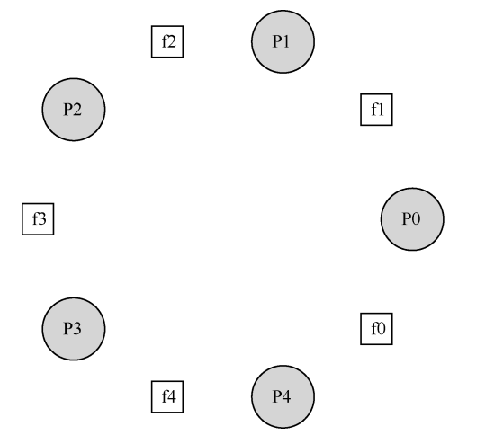

# 第三十一章-信号量

从前两篇文章可知**条件变量**必须和**锁**配合使用，那为什么不直接封装在一起呢？于是就有个信号量。

**信号量**只是将锁和单值条件的条件变量**封装**在一起，所以它不是一个全新的概念，它能实现的事锁加条件变量都能实现。对于比较复杂情况下的条件判断无法使用信号量解决，因为其只内置了一个简单的整型的 value 条件。

### 信号量的定义

信号量是有一个整数值的对象，可以用两个函数来操作它。在 POSIX 标准中，是`sem_wait()`和 `sem_post()`。

```c
#include <semaphore.h>
sem_t s;
sem_init(&s, 0, 1);
```

sem\_init 用于初始化信号量，其中通过第三个参数将它的值初始化为1；第二个参数表示信号量是在同一个进程的多个线程共享的，我们可以看到在所有的例子中都设置为0，这个参数的值涉及到信号量的其他用法（比如跨进程的同步访问）。信号量初始化后，可以调用`sem_wait()`和 `sem_post()`来使用：

```c
int sem_wait(sem_t *s) {
    decrement the value of semaphore s by one
    wait if value of semaphore s is negative
}

int sem_post(sem_t *s) {
    increment the value of semaphore s by one
    if there are one or more threads waiting, wake one
}
```

* sem\_wait()要么`立刻返回`（调用 sem\_wait()时，信号量的值`大于等于 1`），同时`信号量减1`，要么会让调用线程`挂起`，直到之后的一个 post 操作。
* sem\_post()并没有等待某些条件满足。它直接`增加信号量`的值，如果有等待线程，`唤醒`其中一个。
* 当信号量的值为`负数`时，这个值就是`等待线程`的个数

### 二值信号量（锁）

首先我们看看信号量的第一种用法：用信号量作为锁。下面的代码中我们直接在临界区中用一对 `sem_wait()/sem_post()` 来包裹。但为了使这段代码正常工作，信号量的初始化是至关重要的。因为信号量是一个有整数值的对象，因此初始值应该是 1。代码如下：

```c
sem_t m;
// 初值要为1
sem_init(&m, 0, 1);

sem_wait(&m);
// critical section here
sem_post(&m);
```

### 信号量用作条件变量

举一个具体的例子，假设一个线程创建另外一线程，并且等待它结束:

```c
sem_t s;

void *
child(void *arg)
{
    printf("child\n");
    sem_post(&s); // signal here: child is done
    return NULL;
}

int main(int argc, char *argv[])
{
    // X初始值应是0
    sem_init(&s, 0, X); // what should X be?
    printf("parent: begin\n");
    pthread_t c;
    Pthread_create(c, NULL, child, NULL);
    sem_wait(&s); // wait here for child
    printf("parent: end\n");
    return 0;
}
```

### 生产者/消费者问题

我们再尝试通过信号量来解决上一章提到的「生产者/消费者」问题，下面的代码通过三个信号量的组合使用解决了互斥与死锁两个问题，代码如下：

```c
sem_t empty;
sem_t full;
sem_t mutex;

void *producer(void *arg)
{
    int i;
    for (i = 0; i < loops; i++)
    {
        // empty/full是一个条件变量，用于唤醒和等待
        // 不过可以自动形成等待队列，比条件变量方便
        sem_wait(&empty); // line p1
        // mutex是一个锁，用于商品队列的操作的保护
        // 锁的作用域很重要，尽可能缩小临界区来避免死锁和提高性能
        sem_wait(&mutex); // line p1.5 (MOVED MUTEX HERE...)
        put(i);           // line p2
        sem_post(&mutex); // line p2.5 (... AND HERE)
        sem_post(&full);  // line p3
    }
}

void *consumer(void *arg)
{
    int i;
    for (i = 0; i < loops; i++)
    {
        sem_wait(&full);  // line c1
        sem_wait(&mutex); // line c1.5 (MOVED MUTEX HERE...)
        int tmp = get();  // line c2
        sem_post(&mutex); // line c2.5 (... AND HERE)
        sem_post(&empty); // line c3
        printf("%d\n", tmp);
    }
}

int main(int argc, char *argv[])
{
    // ...
    sem_init(&empty, 0, MAX); // MAX buffers are empty to begin with...
    sem_init(&full, 0, 0);    // ... and 0 are full
    sem_init(&mutex, 0, 1);   // mutex=1 because it is a lock
    // ...
}
```

### 读写锁

并发编程中另一个经典的问题是源于对「更加灵活的锁定原语」的渴望，也就是说对更细粒度的锁的渴望。比如一个并发链表有很多插入和查找操作。插入会修改链表的状态，而查找只是读取。也就是说其实只要没有插入操作，我们可以并发的执行多个查找操作。

> 笔者认为所谓「更加灵活的锁定原语」或「如何提高锁的性能」等问题，其实都可以说是减少**临界区代码**，因为临界区代码其实只是并发编程中的一段「临时串行」的代码。而提高锁的性能、或者更加灵活的锁定原语，其实就是通过技巧来减少「临界区代码」，从而提高锁的效率。
>
> 比如：并发队列中将一把大锁拆分成入队/出队两把锁，从而提高了并发效率。这其实就是常说的减少锁的粒度


### 哲学家就餐问题

假定有 5 位“哲学家”围着一个圆桌。每两位哲学家之间有一把餐叉（一共 5 把）。哲学家有时要`思考`一会，不需要餐叉；有时又要`就餐`。而一位哲学家只有同时拿到了左手边和右手边的`两把餐叉`，才能吃到东西。如下图：

<figure><figcaption></figcaption></figure>

我们将上面提到的过程，用代码转译一下：

```c
while (1) {
    think();
    getforks();
    eat();
    putforks();
}
```

因此我们可以看到，关键的挑战就是如何实现 `getforks()`和 `putforks()`函数，保证没有死锁，没有哲学家饿死，并且并发度更高（尽可能让更多哲学家同时吃东西）。我们首先定义一下这两个函数：

```c
int left(int p) { return p; }
int right(int p) { return (p + 1) % 5; }
```

我们现在都知道，遇到并发问题第一个是加锁来解决，那么我们为每个动作都加锁：

```c
void getforks() {
    sem_wait(forks[left(p)]);
    sem_wait(forks[right(p)]);
}

void putforks() {
    sem_post(forks[left(p)]);
    sem_post(forks[right(p)]);
}
```

但这个方案有一个问题，会形成死锁，每个人都拿着左手边的叉子就无法继续了（循环等待）。而解决这个问题最简单的方法，就是修改取餐叉的顺序，比如最后一个人先取右边的餐叉，然后再拿左边的，从而打破死锁（循环等待）：

```c
void getforks()
{
    if (p == 4)
    {
        sem_wait(forks[right(p)]);
        sem_wait(forks[left(p)]);
    }
    else
    {
        sem_wait(forks[left(p)]);
        sem_wait(forks[right(p)]);
    }
}
```

### 如何实现信号量

最后我们用底层的同步原语（锁和条件变量），来实现自己的信号量：

```c
typedef struct _Zem_t
{
    int value;
    pthread_cond_t cond;
    // 对value的修改锁
    pthread_mutex_t lock;
} Zem_t;

// only one thread can call this
void Zem_init(Zem_t *s, int value)
{
    s->value = value;
    Cond_init(&s->cond);
    Mutex_init(&s->lock);
}

void Zem_wait(Zem_t *s)
{
    Mutex_lock(&s->lock);
    while (s->value <= 0)
        Cond_wait(&s->cond, &s->lock);
    // 在这里递减value，value值就不会小于0了。
    s->value--;
    Mutex_unlock(&s->lock);
}

void Zem_post(Zem_t *s)
{
    Mutex_lock(&s->lock);
    s->value++;
    Cond_signal(&s->cond);
    Mutex_unlock(&s->lock);
}
```


### 小结

信号量是编写并发程序强大而灵活的原语，信号量基于锁和条件变量，可以实现两者的功能。

* 作为锁时，可以自动管理等待队列。
* 作为条件变量时，免去了 while 判断是否需要等待的操作，因为内部包含了一个 value 值用于判断

\


