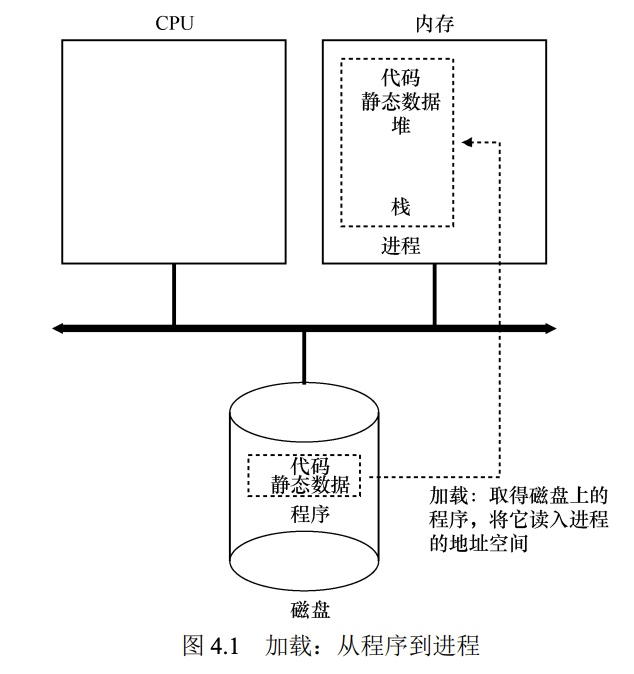

# 第四章-抽象：进程

这章讲的是操作系统提供的最基本的抽象——进程。进程简单的来说其实就是「运行中的程序」。程序本身只是存在磁盘的一些静态数据、指令。

我们在使用计算机的过程中，通常都会运行多个程序。比如：同时运行浏览器、播放器、游戏等等。除了这些我们熟知的程序外，系统内部还运行着上百个程序。现代的处理器一般都有多个核（注意，这里的核其实是指一个「运算单元」也就是一个 CPU，也就是说我们平时购买的一个物理的 CPU 里面，一般是有多个 CPU 的）。如果每个程序都独占一个CPU，那么就可能需要上百个「运算单元」，那么这样的 CPU 也太过昂贵了。

这也是操作系统需要解决的问题：「如何提供有许多CPU的假象」。操作系统通过虚拟化（virtualizing）CPU 来提供这种假象。通过让一个进程只运行一个时间片，然后切换到其他进程，操作系统就提供了存在许多 CPU 的假象了。通俗的来讲就是通过超快速的切换进程，从而达到让用户看起来每个进程都在同时运行。

### 进程 API

* 创建（Create）：用于创建新进程的方法。比如 shell 中键入命令或者在桌面双击应用图标时，就会调用操作系统来创建新的进程，运行指定的程序。
* 销毁（destroy）：有创建的接口那当然还需要销毁的接口，因此系统还提供强制销毁进程的接口，确保用户可以随时的终止它们。虽然进程运行完成后正常会自动退出，但也可能会因为意外的操作导致它不退出，因此该接口也是一个兜底的操作。
* 等待（wait）：等待进程停止运行。
* 状态（status）：获取有关进程的状态信息。例如运行了多长时间、当前处于什么状态等。
* 其他控制（miscellaneous control）：除了上面的操作外，有时还可能有其他控制，比如大多数操作系统提供某种方法来暂停进程（停止运行一段时间）。

### 进程创建

首先看一下一个程序是如何转换为进程的。具体来说是操作系统是如何启动并运行一个程序的？

操作系统运行程序必须做的第一件事是将代码和所有静态数据（例如初始化变量）加载（load）到内存中，加载到进程的地址空间中。简单的来说就是从持久化存储的「磁盘」导入到易失的「内存」中。（如下图所示）

<figure><figcaption></figcaption></figure>

在早起的操作系统中，加载的这个过程是尽早（eagerly）完成，即在运行程序之前全部完成。现代操作系统则是惰性（lazily）执行该过程，即仅在程序运行期间按需加载代码或数据片段。这个过程涉及到内存虚拟化，后面的对应章节会展开具体讲解。

加载到内存后操作系统在运行之前还会执行其他一些操作，比如为程序运行时的栈（run-time stack 或 stack）、堆（heap）、局部变量等分配一些内存。此外还会执行一些其他初始化任务，特别是输入输出（I/O）相关的任务，例如：stdin、stdout、stderr等等。最后会跳转到程序的入口，也就是 `main()` 函数，至此 OS 会将 CPU 的控制权转交到新创建的进程中，程序开始运行。

为此进程的创建过程总结如下：

1. 加载数据到内存
2. 为栈分配空间
3. 为堆分配空间
4. I/O初始化
5. 运行程序入口（`main` 函数）


### 进程状态

进程的三种状态：

* 运行（running）：运行状态表示它正在执行指令，意味着进程正在处理器上运行。
* 就绪（ready）：该状态表示程序已经准备好运行了，只是操作系统还未选择该进程运行
* 阻塞（blocked）：在阻塞状态下，一个进程执行了某种操作，直到发生其他事件时才会准备运行。常见的例子是，当进程向磁盘发起 I/O 请求时，它会被阻塞，因此其他进程可以在这时候使用处理器，提高处理器的使用率。

<figure><figcaption><p>进程状态转换</p></figcaption></figure>

上图展示了上述三种状态之间的转换关系，可以根据操作系统的载量，让进程在就绪状态和运行状态之间转换。从**就绪 -> 运行**意味着该进程已经被**调度**（scheduled）。从**运行 -> 就绪**意味着该进程已经**取消调度**（descheduled）。一旦进程被阻塞（例如，通过发起 I/O 操作），OS 将保持进程的这种状态，直到发生某种事件（例如，I/O 完成）。此时，进程再次转入就绪状态（也可能立即再次运行，如果操作系统这样决定）。

关于调度的策略，简单总结下，就是`一个进程`**`阻塞或停止`**`时，就会去调度另一个`**`就绪`**`的进程`，让 CPU 一直保持在满负荷状态，从而提高 CPU 的使用率。


### 数据结构

为了跟踪每个进程的状态，操作系统可能会为所有就绪的进程保留某种`进程列表`（process list），以及跟踪当前正在运行的进程的一些附加信息。操作系统还必须以某种方式跟踪`被阻塞的进程`。当 I/O 事件完成时，操作系统应确保`唤醒`正确的进程，让它准备好再次运行。

那么既然操作系统也是个程序，并且是由C语言编写的，因此我们可以来看看进程在代码中的数据结构是啥样的，这无疑有利于我们对进程的理解：

```c
// the registers xv6 will save and restore
// to stop and subsequently restart a process
struct context
{
    int eip;
    int esp;
    int ebx;
    int ecx;
    int edx;
    int esi;
    int edi;
    int ebp;
};
// the different states a process can be in
// 可以看到实际操作系统对于进程状态的定义远不止上面介绍的3种
enum proc_state
{
    UNUSED,
    EMBRYO,
    SLEEPING,
    RUNNABLE,
    RUNNING,
    ZOMBIE
};
// the information xv6 tracks about each process
// including its register context and state
struct proc
{
    char *mem;    // Start of process memory
    uint sz;      // Size of process memory
    char *kstack; // Bottom of kernel stack
    // for this process
    enum proc_state state;      // Process state
    int pid;                    // Process ID
    struct proc *parent;        // Parent process
    void *chan;                 // If non-zero, sleeping on chan
    int killed;                 // If non-zero, have been killed
    struct file *ofile[NOFILE]; // Open files
    struct inode *cwd;          // Current directory
    struct context context;     // Switch here to run process
    struct trapframe *tf;       // Trap frame for the
                                // current interrupt
};
```

该数据结构展示了 xv6 内核中每个进程的相关信息类型。这里用到 XV6 内核是因为它足够简单，是上手操作系统的一个不错选择 。 并且在“真正的”操作系统中存在类似的进程结构，如 Linux、macOS X 或 Windows。

除了`运行`、`就绪`和`阻塞`之外，还有其他一些进程可以处于的状态：

*   **初始（initial）状态**

    有时候系统会有一个初始（initial）状态，表示进程在创建时处于的状态。
*   **最终（final）状态**

    另外，一个进程可以处于已退出但尚未清理的最终（final）状态（在基于 UNIX 的系统中，这称为`僵尸状态`）。这个最终状态非常有用，因为它允许其他进程（通常是创建进程的父进程）检查进程的`返回代码`，并查看刚刚完成的进程`是否成功执行`（通常，在基于 UNIX 的系统中，程序成功完成任务时返回零，否则返回非零）。完成后，父进程将进行最后一次调用（例如，wait()），以等待子进程的完成，并告诉操作系统它可以清理这个正在结束的进程的所有相关数据结构

### 作业

关于作业，本文只摘取部分我认为比较重要的部分：立即处理阻塞完成的进程是否是一个好主意?（也就是第六题）

* 第六题：在本题中，进程 0 首先进入 IO，此时由于`-S SWITCH_ON_IO`参数，进程 0 进入阻塞状态，cpu 被切换到运行进程 1，当进程 0 的 IO 完成后，进程 1 继续执行，直到完成。也就是 IO 完成事件不会被立即处理，由于进程 0 的 IO 动作较为频繁，会使它长时间处于 IO 完成等待状态，导致后续的 IO 操作时 cpu 已经无事可做了，在本例条件下降低了效率，输出如下：

```bash
$ python3 ./process-run.py -l 3:0,5:100,5:100,5:100 -S SWITCH_ON_IO -I IO_RUN_LATER -c -p
Time        PID: 0        PID: 1        PID: 2        PID: 3           CPU           IOs
  1         RUN:io         READY         READY         READY             1          
  2        BLOCKED       RUN:cpu         READY         READY             1             1
  3        BLOCKED       RUN:cpu         READY         READY             1             1
  4        BLOCKED       RUN:cpu         READY         READY             1             1
  5        BLOCKED       RUN:cpu         READY         READY             1             1
  6        BLOCKED       RUN:cpu         READY         READY             1             1
  7*         READY          DONE       RUN:cpu         READY             1          
  8          READY          DONE       RUN:cpu         READY             1          
  9          READY          DONE       RUN:cpu         READY             1          
 10          READY          DONE       RUN:cpu         READY             1          
 11          READY          DONE       RUN:cpu         READY             1          
 12          READY          DONE          DONE       RUN:cpu             1          
 13          READY          DONE          DONE       RUN:cpu             1          
 14          READY          DONE          DONE       RUN:cpu             1          
 15          READY          DONE          DONE       RUN:cpu             1          
 16          READY          DONE          DONE       RUN:cpu             1          
 17    RUN:io_done          DONE          DONE          DONE             1          
 18         RUN:io          DONE          DONE          DONE             1          
 19        BLOCKED          DONE          DONE          DONE                           1
 20        BLOCKED          DONE          DONE          DONE                           1
 21        BLOCKED          DONE          DONE          DONE                           1
 22        BLOCKED          DONE          DONE          DONE                           1
 23        BLOCKED          DONE          DONE          DONE                           1
 24*   RUN:io_done          DONE          DONE          DONE             1          
 25         RUN:io          DONE          DONE          DONE             1          
 26        BLOCKED          DONE          DONE          DONE                           1
 27        BLOCKED          DONE          DONE          DONE                           1
 28        BLOCKED          DONE          DONE          DONE                           1
 29        BLOCKED          DONE          DONE          DONE                           1
 30        BLOCKED          DONE          DONE          DONE                           1
 31*   RUN:io_done          DONE          DONE          DONE             1          

Stats: Total Time 31
Stats: CPU Busy 21 (67.74%)
Stats: IO Busy  15 (48.39%)

```

* 为什么运行一个刚刚完成 I/O 的进程会是一个好主意? 对于 IO 频繁的应用来说，立即运行和不立即运行会有这么两种情况：
  * 立即运行：因为该进程是一个 IO 频繁的应用，因此立即执行后可以立马的进行下一个 IO 操作，进入阻塞态，让出 CPU 的同时等待下一个 IO 事件。
  * 不立即运行：在上一个 IO 完成后，CPU 调度前的时间将会被白白浪费，因为该进程是一个 IO 频繁的。输出如下：

```bash
$ python3 ./process-run.py -l 3:0,5:100,5:100,5:100 -S SWITCH_ON_IO -I IO_RUN_IMMEDIATE -c -p
Time        PID: 0        PID: 1        PID: 2        PID: 3           CPU           IOs
  1         RUN:io         READY         READY         READY             1          
  2        BLOCKED       RUN:cpu         READY         READY             1             1
  3        BLOCKED       RUN:cpu         READY         READY             1             1
  4        BLOCKED       RUN:cpu         READY         READY             1             1
  5        BLOCKED       RUN:cpu         READY         READY             1             1
  6        BLOCKED       RUN:cpu         READY         READY             1             1
  7*   RUN:io_done          DONE         READY         READY             1          
  8         RUN:io          DONE         READY         READY             1          
  9        BLOCKED          DONE       RUN:cpu         READY             1             1
 10        BLOCKED          DONE       RUN:cpu         READY             1             1
 11        BLOCKED          DONE       RUN:cpu         READY             1             1
 12        BLOCKED          DONE       RUN:cpu         READY             1             1
 13        BLOCKED          DONE       RUN:cpu         READY             1             1
 14*   RUN:io_done          DONE          DONE         READY             1          
 15         RUN:io          DONE          DONE         READY             1          
 16        BLOCKED          DONE          DONE       RUN:cpu             1             1
 17        BLOCKED          DONE          DONE       RUN:cpu             1             1
 18        BLOCKED          DONE          DONE       RUN:cpu             1             1
 19        BLOCKED          DONE          DONE       RUN:cpu             1             1
 20        BLOCKED          DONE          DONE       RUN:cpu             1             1
 21*   RUN:io_done          DONE          DONE          DONE             1          

Stats: Total Time 21
Stats: CPU Busy 21 (100.00%)
Stats: IO Busy  15 (71.43%)
```


